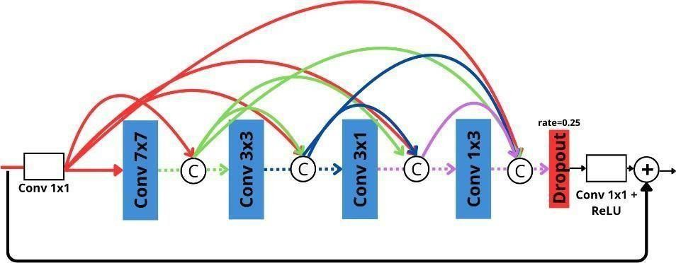
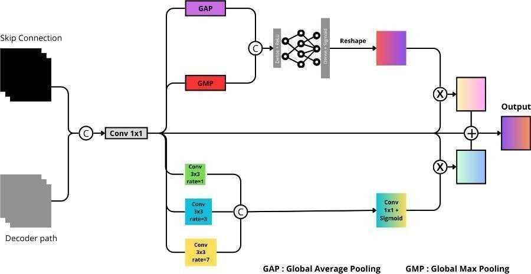
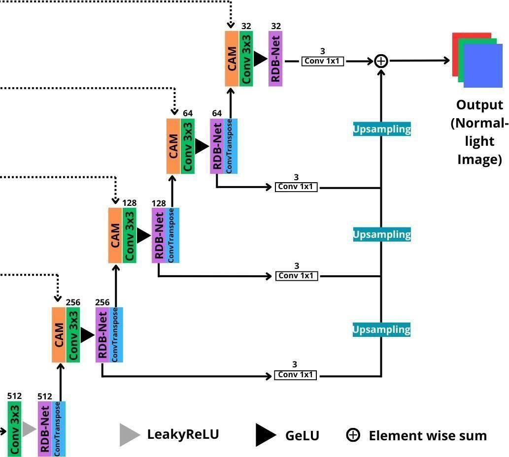

# LL-DSV-UNet: Low-Light Image Enhancement via Multi-Level Fusion Deep Supervision Mechanism

<p align="center">
  
</p>

<p align="center">
  <a href="https://github.com/yourusername/LL-DSV-UNet/actions">
    
  </a>
  <a href="LICENSE">
    
  </a>
  
  
  
</p>

---

## Overview

**LL-DSV-UNet** is a deep learning model for **Low-Light Image Enhancement (LLIE)** built on a heavily modified U-Net backbone. The central contribution is a novel **Multi-Level Fusion Deep Supervision (MLFDS)** mechanism — a departure from conventional deep supervision that computes separate losses per auxiliary head.

> Instead of weighting and summing *N* auxiliary losses, MLFDS aligns and fuses intermediate decoder outputs at full resolution before computing a **single unified loss**, enabling implicit multi-level reconstruction supervision with simpler training dynamics.

### Key architectural innovations

| Component | Description |
|---|---|
| **MLFDS** | Auxiliary heads from all 4 decoder stages are upsampled, aligned, and fused via element-wise addition → one loss computation |
| **RDB-Net** | Residual Dense Block with asymmetric multi-scale dilated convolutions (7×7, 3×3, 3×1, 1×3) |
| **Contextual Attention Module** | Per-skip-connection module combining channel attention (FC gates) and spatial attention (multi-scale dilated conv) |
| **Dual-path downsampling** | AveragePool + direct MaxPool branch from input at each encoder stage, combined via element-wise addition |
| **Custom Loss** | L_mae + L_color + 0.2 × L_cs (contrast-structure loss derived from SSIM C·S terms) |

---
## Result LL-DSV-UNet on LOL Eval15 (Against the Baseline Model)
<p align="center">
  
</p>

| Method | PSNR (dB) ↑ | SSIM ↑ | LPIPS ↓ |
|---|---|---|---|
| U-Net Standard by Ronneberger et al. | 22.73 | 0.868 | 0.215 |
| Wavelet U-Net by Wang et al. | 19.83 | 0.758 | 0.370 |
| U-Net Modified by Chai et al. | 24.80 | 0.896 | 0.154 |
| U-Net -- by Yin et al. | 19.91 | 0.639 | 0.496 |
| **LL-DSV-UNet (Our)** | **24.05** | **0.898** | **0.135** |

## Results LL-DSV-UNet on LOL Eval15 (towards variations in deep supervision) 

| DS Variant | PSNR (dB) ↑ | SSIM ↑ | LPIPS ↓ |
|---|---|---|---|
| Without Deep Supervision | 20.67 | 0.815 | 0.320 |
| Standard Deep Supervision | 19.29 | 0.668 | 0.504 |
| **Our Deep Supervision** | **21.36** | **0.847** | **0.251** |

---

## Core Architectural Components

**Residual Dense Block Networks (RDB-Nets)**
Residual Dense Block Networks (RDB-Nets), a convolutional block design that utilizes the advantages of Residual Connection, Dense Connection, and Multi-scale receptive fields arranged hierarchically and sequentially to capture complex features from global to local scales in stages. To optimize computational efficiency, channel reduction is initially performed to a quarter of the original size.

<p align="center">
  
</p>

**Contextual Attention Module (CAM)**
The Contextual Attention Module (CAM) is an attention mechanism design that combines Channel Attention and Spatial Attention components in parallel with separate pathways. The attention channel utilizes Global Max Pooling (GMP) and Global Average Pooling (GAP), followed by MLP layers. Spatial attention utilizes Dilated Convolution (rate = [1, 3, 7]) to efficiently capture multi-scale spatial features.

<p align="center">
  
</p>

**Multi-Level Fusion Deep Supervision (MLFDS)**
Multi-Level Fusion Deep Supervision (MLFDS) is a new innovation in implementing deep supervision that is more stable and robust to supervise the image reconstruction process of the decoder network through Multi-Level Fusion output and a single loss calculation. Deep supervision usually performs loss and gradient calculations for a specified number of levels, this allows gradient explosions because they come from multiple directions at once. In addition, when the number of levels, the loss weight is not set properly, it will actually disrupt the model training process. MLFDS overcomes this problem by combining the outputs from all levels into a single aggregated output with Element-wise addition, while the loss calculation is only once on the aggregated output.

<p align="center">
  
</p>

---

## Project Structure

```
LL-DSV-UNet/
├── lldsvunet/                  ← Installable Python package
│   ├── model/
│   │   ├── blocks.py           ← RDBNet, ContextualAttention, DecoderBlock
│   │   ├── architecture.py     ← Full LL-DSV-UNet model builder
│   │   └── losses.py           ← Composite loss functions (L1 loss, SSIM loss, and Color loss)
│   ├── data/
│   │   ├── dataset.py          ← LOL + custom dataset loaders
|   |   ├── LOL_Dataset         ← 485 image paired for Training + 15 image paired for Eval
|   |   └── Additional_Dataset  ← 50 image paired for Extra Training Dataset
│   └── utils/
│       ├── metrics.py          ← PSNR, SSIM, LPIPS, convergence analytics
│       └── visualization.py    ← Plotting utilities
│
├── scripts/
│   ├── train.py                ← Full training pipeline (YAML-configurable)
│   ├── evaluate.py             ← Evaluation with per-image metrics table
│   └── enhance.py              ← Batch inference on a folder of images
│
├── configs/
│   └── default.yaml            ← All hyperparameters in one place
│
├── notebooks/
│   └── demo.ipynb              ← Colab-ready interactive demo
│
├── assets/
│   ├── figures/                ← Training curves, architecture diagrams
│   └── results/                ← Before/after enhancement samples
│
└── .github/
    ├── workflows/ci.yml        ← GitHub Actions: lint + import check
    └── ISSUE_TEMPLATE/
```

---

## Dataset

| Dataset | Split | Images |
|---|---|---|---|
| LOL | Train | 485 pairs |
| Custom (Dataset Primer) | Train | 50 pairs |
| LOL | Eval | 15 pairs |

To mix with your own custom dataset, add the paths to `configs/default.yaml`:

```yaml
data:
  custom_low:  ["data/my_dataset/low"]
  custom_high: ["data/my_dataset/high"]
```

## Quickstart

### 1. Clone & install

```bash
git clone https://github.com/yourusername/LL-DSV-UNet.git
cd LL-DSV-UNet
pip install -r requirements.txt
pip install -e .          # install as editable package (optional)
```

### 2. Train

```bash
python scripts/train.py --config configs/default.yaml
```

Resume from a checkpoint:

```bash
python scripts/train.py --config configs/default.yaml \
    --resume checkpoints/LL-DSV-UNet-best.h5
```

### 3. Evaluate

```bash
python scripts/evaluate.py \
    --model  checkpoints/LL-DSV-UNet-final.h5 \
    --low    data/lol_dataset/eval15/low \
    --high   data/lol_dataset/eval15/high \
    --save_grid assets/results/eval_grid.png
```

### 4. Enhance your own images (batch)

```bash
python scripts/enhance.py \
    --model   checkpoints/LL-DSV-UNet-final.h5 \
    --input   path/to/your/dark_images/ \
    --output  path/to/enhanced_output/
```

---

## Fine-tuning on your own data

LL-DSV-UNet is designed for easy fine-tuning. Load the pretrained weights and continue training with your own dataset:

```python
import tensorflow as tf
from lldsvunet.model.losses import custom_loss

# Load pretrained model
model = tf.keras.models.load_model(
    "checkpoints/LL-DSV-UNet-final.h5",
    custom_objects={"custom_loss": custom_loss}
)

# Recompile with a lower learning rate for fine-tuning
model.compile(
    optimizer=tf.keras.optimizers.Adam(learning_rate=1e-6, beta_2=0.99),
    loss=custom_loss
)

# Train on your paired data
model.fit(x_custom, y_custom, batch_size=16, epochs=200,
          validation_split=0.1)
```

---

## Programmatic API

```python
from lldsvunet import build_lldsvunet, custom_loss, evaluate_model
import tensorflow as tf

# Build model from scratch
model = build_lldsvunet(
    input_shape   = (200, 300, 3),
    base_filters  = 32,
    learning_rate = 1e-5,
)

# Or load pretrained weights
model = tf.keras.models.load_model(
    "checkpoints/LL-DSV-UNet-final.h5",
    custom_objects={"custom_loss": custom_loss}
)

# Run inference
import numpy as np
low_image = np.random.rand(1, 200, 300, 3).astype("float32")
enhanced  = model.predict(low_image)

# Evaluate
scores = evaluate_model(y_true, y_pred)
print(f"PSNR: {scores['psnr']:.2f} dB | SSIM: {scores['ssim']:.4f}")
```

---

## Training Configuration

All hyperparameters are managed via `configs/default.yaml`. Key settings:

```yaml
data:
  lol_root:    "data/lol_dataset"
  target_size: [200, 300]
  val_split:   0.1

model:
  base_filters: 32

training:
  epochs:        1000
  batch_size:    32
  learning_rate: 0.00001
  beta_2:        0.99
  early_stopping_patience: 150
  reduce_lr_patience:       75
```

---

## Environment

| Dependency | Version |
|---|---|
| Python | ≥ 3.9 |
| TensorFlow / Keras | ≥ 2.12, < 2.16 |
| NumPy | ≥ 1.23 |
| scikit-image | ≥ 0.20 |
| scikit-learn | ≥ 1.2 |
| Matplotlib | ≥ 3.6 |
| PyYAML | ≥ 6.0 |
| torch + torchmetrics | Optional (LPIPS only) |

---

## Citation

If you use this work in your research, please cite:

```bibtex
@misc{yourlastname2025lldsvunet,
  author    = {Your Full Name},
  title     = {LL-DSV-UNet: Low-Light Image Enhancement via Multi-Level Fusion Deep Supervision},
  year      = {2025},
  publisher = {GitHub},
  url       = {https://github.com/riko-okananta/LL-DSV-UNet}
}
```

---

## License

This project is licensed under the **MIT License** — see [LICENSE](LICENSE) for details.

---

## Acknowledgements

- [LOL Dataset](https://daooshee.github.io/BMVC2018website/) — Wei et al., BMVC 2018
- [U-Net](https://arxiv.org/abs/1505.04597) — Ronneberger et al., MICCAI 2015
- Training infrastructure: [Kaggle Notebooks](https://www.kaggle.com/)
